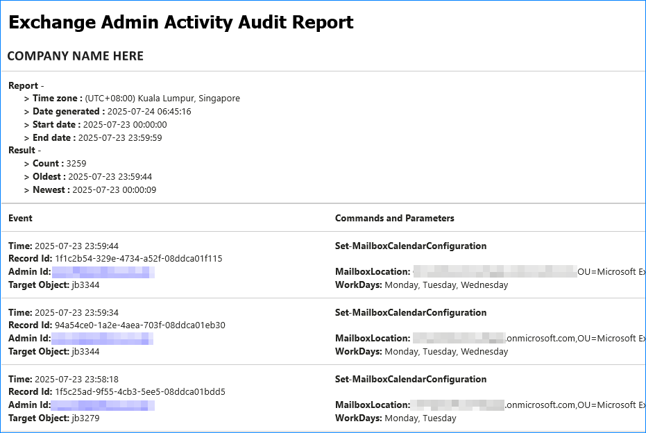

# PS-EXO-Admin-Audit-Log-Report

A lightweight PowerShell module to query **Exchange Online admin audit logs** using Exchange Online PowerShell module and export the results into a readable CSV report. Ideal for compliance, security, and operational audit reporting.

## ✨ Features

- Uses `Search-UnifiedAuditLog` to retrieve Exchange Online administrative actions.
- Outputs audit records to a custom HTML report.
- Customizable start and end date filters.
- Supports silent mode for unattended/automated use.

## 📦 Installation

Clone or download the module, then import it:

```powershell
# Example path
Import-Module "C:\Path\To\PS-EXO-Admin-Audit-Log-Report\PsExoAdminAuditLogReport.psm1"
```

> ℹ️ Requires Exchange Online PowerShell module (`ExchangeOnlineManagement`) and connection to Exchange Online.

---

## 🛠️ Usage

The module exposes two public functions:

### `Get-ExoAdminAuditLogs`

Queries Exchange Online admin audit logs between the specified start and end dates.

#### Syntax

```powershell
Get-ExoAdminAuditLogs [-StartDate] <Object> [-EndDate] <Object> [[-PageSize] <int>] [-ShowProgress <bool>] [-MaxRetryCount <int>] [<CommonParameters>]
```

#### Parameters

| Name            | Type     | Description                                                                                    | Required |
| --------------- | -------- | ---------------------------------------------------------------------------------------------- | -------- |
| `StartDate`     | DateTime | Start date for audit log retrieval.                                                            | Yes      |
| `EndDate`       | DateTime | End date for audit log retrieval.                                                              | Yes      |
| `ShowProgress`  | Switch   | Whether to show a progress indicator.                                                          | No       |
| `PageSize`      | Integer  | Set the number of results to return on each run.<br>The default value is 500, maximum is 5000. | No       |
| `MaxRetryCount` | Integer  | The number of tries to retry if the previous extraction has an error.                          | No       |

#### Example

```powershell
Get-ExoAdminAuditLogs -StartDate (Get-Date).AddDays(-7) -EndDate (Get-Date)
```

---

### `Write-ExoAdminAuditReport`

Takes output from `Get-ExoAdminAuditLogs` and writes it to a CSV file.

#### Syntax

```powershell
Write-ExoAdminAuditReport [-InputObject] <Object> [-Organization <string>] [-TruncateLongValue <int>] [-OutHtml <string>] [-ConvertToLocalTime] [<CommonParameters>]
```

#### Parameters

| Name                 | Type   | Description                                                             | Required |
| -------------------- | ------ | ----------------------------------------------------------------------- | -------- |
| `InputObject`        | Object | The audit log data (from `Get-ExoAdminAuditLogs`)                       | Yes      |
| `OutHtml`            | String | File path to save the HTML report.                                      | No       |
| `Organization`       | String | Custom organization name to appear in the report.                       | No       |
| `ConvertToLocalTime` | Switch | Converts the datetime values in the report from UTC to local time zone. | No       |
| `TruncateLongValue`  | Int    | Truncate long values to a specific maximum number of characters.        | No       |

#### Example

```powershell
$auditLogs = Get-ExoAdminAuditLogs -StartDate (Get-Date).AddDays(-30) -EndDate (Get-Date)
Write-ExoAdminAuditReport -InputObject $auditLogs -OutHtml "C:\Reports\exo-audit.html" -Organization 'Custom Org Name'
```

---

## 🗂 Output

The `Write-ExoAdminAuditReport` command generates an HTML file that shows the following:



> ✅ Useful for audit trail reviews, change tracking, and compliance checks.

---

## 📁 File Structure

```TEXT
.
├── PsExoAdminAuditLogReport.psd1       # Module manifest
├── PsExoAdminAuditLogReport.psm1       # Module loader
├── source/
│   ├── public/
│   │   ├── Get-ExoAdminAuditLogs.ps1   # Retrieves audit logs
│   │   └── Write-ExoAdminAuditReport.ps1 # Writes report to file
│   └── private/
│       └── SayX.ps1                    # Internal helper (e.g., Write-Host abstraction)
```

---

## ⚙️ Requirements

- PowerShell 5.1 or later
- ExchangeOnlineManagement module
- Appropriate Exchange Online admin role to query audit logs
- If used for unattended jobs, follow the instructions at [App-only authentication for unattended scripts in Exchange Online PowerShell](https://learn.microsoft.com/en-us/powershell/exchange/app-only-auth-powershell-v2?view=exchange-ps) and refer to the [Set up app-only authentication](https://learn.microsoft.com/en-us/powershell/exchange/app-only-auth-powershell-v2?view=exchange-ps#set-up-app-only-authentication) section.

---

## 🔍 Notes

- This module only performs the audit logs search and creating the report.
- There is no built-in capability to send the report to email.
- You may use the [`Send-MgUserMail`](https://learn.microsoft.com/en-us/powershell/module/microsoft.graph.users.actions/send-mgusermail) cmdlet to send the generated report to email.

---

## 🧑‍💻 Contributing

Feel free to fork the repo, make changes, and submit pull requests. Suggestions and improvements are welcome!

---

## 📄 License

This project is licensed under the [MIT License](LICENSE).

---

## 📬 Author

**June Castillote**

GitHub: [@junecastillote](https://github.com/junecastillote)
